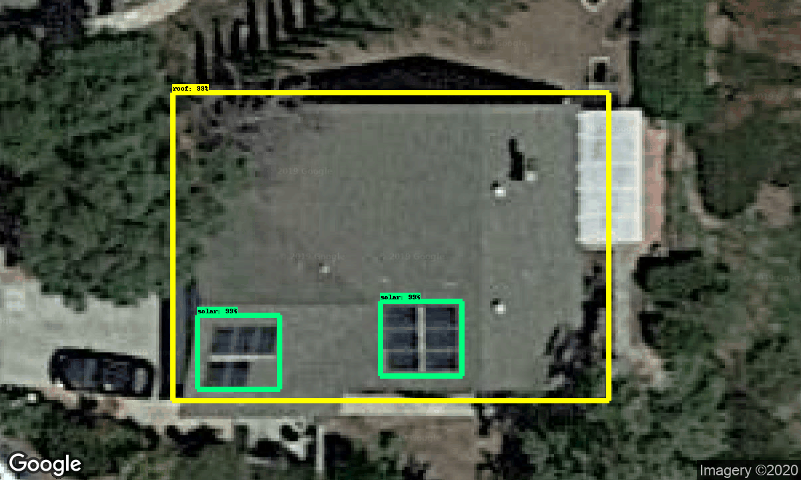
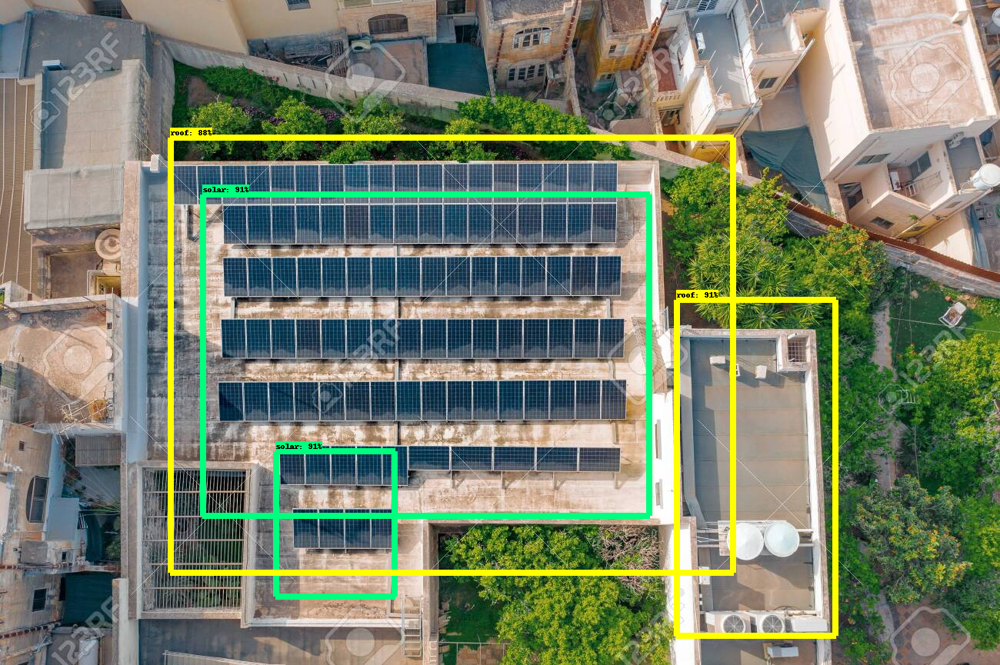

# Solar_Panel-Detection-in-Aerial-Images
Detection of solar Panels in Aerial/Satellite images using faster_rcnn_resnet101_coco config and tensorflow object detection architecture
## MEDIUM BLOG - https://medium.com/@thavani.shiva3/solar-panel-detection-from-aerial-view-or-satellite-images-648c22c260ba

## TO DETECT PRESENCE OF SOLAR PANELS IN AERIAL/SATELLITE IMAGES
There are many real life problems that are in need to be solved by developers and programmers using Object detection techniques. One such problem is detecting solar panels ina aerial images, this use-case will help private solar companies and government to estimate the presence and reach of solar panels in an area by conducting an aerial survey
Instead of training our own model from scratch, one can build on existing models and fine-tune them for your own purpose so I have chosen configurations of Fastnet RCNN model

I have trained a custom solar panel detection model using TensorFlow architecture.

Snapshots of Outcome

